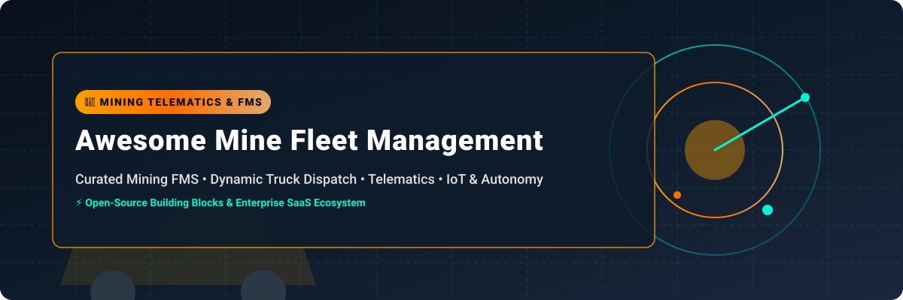

# 🚜 Awesome Mine Fleet Management



<div align="center">

<a href="https://github.com/ishandutta2007/Awesome-Awesome-Awesome"></a><a href="https://discord.gg/jc4xtF58Ve"></a>
[](https://github.com/ishandutta2007/Awesome-Awesome-Awesome)
[](LICENSE)
[](https://github.com/ishandutta2007/Awesome-Mine-Fleet-Management/pulls)
<a href="https://github.com/ishandutta2007"></a>

</div>

---

## 📌 Keywords & Overview

> **Keywords:** *Mine Fleet Management System (FMS), Mining Truck Dispatch, Mine Haulage Optimization, Mining Telematics, Equipment Health Monitoring, Autonomous Mining, Heavy Equipment IoT, Mine Road Routing, Short-Interval Control (SIC), Mining GIS, Open-Source Mine FMS.*

Welcome to the **Awesome Mine Fleet Management** directory! This repository tracks premier **SaaS/Hosted commercial platforms** and **open-source building blocks** for **Mine Fleet Management Systems (FMS)**. These solutions monitor, dispatch, optimize, and automate open-pit and underground mining fleets—including haul trucks, loaders, excavators, drills, LHDs, light vehicles, and autonomous haulage systems (AHS).

---

## 📑 Table of Contents

- [🏢 SaaS & Hosted Commercial Platforms](#-saas--hosted-commercial-platforms)
- [🔓 Open-Source Repositories & Building Blocks](#-open-source-repositories--building-blocks)
  - [🤖 AI, LLM & Machine Learning Frameworks](#-ai-llm--machine-learning-frameworks)
  - [📊 Operational Dashboards & Business Intelligence](#-operational-dashboards--business-intelligence)
  - [💾 Telemetry & Analytical Databases](#-telemetry--analytical-databases)
  - [📡 IoT Infrastructure & Message Brokers](#-iot-infrastructure--message-brokers)
  - [🚛 Dispatch & Route Optimization Engines](#-dispatch--route-optimization-engines)
  - [🗺️ GIS, Spatial & Mine Road Mapping](#-gis-spatial--mine-road-mapping)
  - [🛰️ Telematics & Vehicle Tracking Platforms](#-telematics--vehicle-tracking-platforms)
  - [🤖 Autonomous Mining, Simulation & Robotics](#-autonomous-mining-simulation--robotics)
- [🏗️ Recommended Open-Source Mine FMS Architecture](#️-recommended-open-source-mine-fms-architecture)
- [🗺️ Commercial → Open-Source Mapping](#️-commercial--open-source-mapping)
- [📊 Open-Source Capability Matrix](#-open-source-capability-matrix)
- [🤝 How to Contribute](#-how-to-contribute)
- [💖 Support & Sponsorship](#-support--sponsorship)
- [📈 Star History](#-star-history)
- [⚠️ Disclaimer](#️-disclaimer)

---

## 🏢 SaaS & Hosted Commercial Platforms

> **📊 Industry Market Size & Structure:** The global **Mine Fleet Management System (FMS)** market size is estimated at **$3.85 Billion to $5.20 Billion** (growing at a CAGR of ~7.5%). The market is **moderately concentrated**, led by major industrial heavy equipment OEMs (*Caterpillar, Komatsu, Sandvik, Hitachi/Wenco, Epiroc, Hexagon*) alongside specialized software providers (*Micromine, RPMGlobal, GroundHog, ASI Mining*).

Below is the curated list of enterprise commercial SaaS and hosted mining FMS platforms, sorted by **Company Size (Annual Revenue / Valuation)** in descending order:

| 🏢 Product / Platform | 📝 Description | 💰 Starting Pricing | 🎁 Free Tier / Trial Limit | 🏭 Company Size (Revenue / Valuation) |
| :--- | :--- | :--- | :--- | :--- |
| 🚜 **[Cat MineStar Fleet](https://www.cat.com/en_US/by-industry/mining/surface-mining/surface-technology/fleet.html)** / **[Cat MineStar](https://www.cat.com/en_US/by-industry/mining/minestar-solutions.html)** | Caterpillar's flagship FMS providing real-time cycle-time tracking, haulage assignment, payload monitoring, autonomy (Command), and machine health. | **$1,200 / vehicle / month** (Base quote starting tier) | **No free tier**; 30-day interactive sandbox demo upon request | **~$67.1 Billion Rev** (~$160B Valuation) |
| 🚛 **[Modular Mining DISPATCH](https://www.komatsu.com/en-us/technology/smart-mining/loading-and-haulage/dispatch)** / **[Komatsu Ecosystem](https://www.komatsu.com/en-us/technology/smart-mining/modular)** | Komatsu's foundational mine dispatch FMS for dynamic truck-shovel assignment, mine planning execution, fuel management (Replenish), and roadways optimization. | **$1,000 / vehicle / month** (Enterprise site license quote) | **No free tier**; 14-day guided proof-of-concept environment | **~$25.4 Billion Rev** (~$35B Valuation) |
| 🛠️ **[Sandvik OptiMine](https://www.rocktechnology.sandvik/en/products/automine-and-optimine/optimine/)** | Integrated underground & surface digital mining platform for telemetry monitoring, process analytics, location tracking, and short-interval control. | **$850 / machine / month** (Starting platform tier) | **No free tier**; 30-day trial instance upon request | **~$11.8 Billion Rev** (~$24B Valuation) |
| 🌐 **[Wenco Mining Systems](https://www.wencomine.com/our-solutions/mining-fleet-management)** / **[Dynamic Dispatch](https://www.wencomine.com/our-solutions/dispatching)** | Hitachi subsidiary providing dynamic truck dispatching, production monitoring, equipment health, and haul-road traffic optimization for open-pit mines. | **$900 / vehicle / month** (Entry fleet package) | **No free tier**; 14-day evaluation trial environment | **~$9.2 Billion Rev** (Hitachi Construction ~$9.2B Rev) |
| 📡 **[Epiroc Mobilaris Mining Intelligence](https://www.epiroc.com/en-us/customer-stories/2023/optimizing-flows)** | Situational-awareness and tracking system providing 3D real-time location, traffic awareness, and shift planning for underground mining operations. | **$750 / asset / month** (Base package) | **No free tier**; 14-day virtual site trial upon request | **~$5.6 Billion Rev** (~$18B Valuation) |
| 🛰️ **[Hexagon HxGN MineOperate](https://hexagon.com/solutions/mine-fleet-management)** / **[Asset Health](https://hexagon.com/products/hexagon-asset-health)** | Comprehensive mine fleet optimization suite featuring real-time dispatch, blending control, haulage analytics, machine health monitoring, and safety alerts. | **$950 / asset / month** (Base operational suite quote) | **No free tier**; 30-day proof-of-concept trial environment | **~$5.4 Billion Rev** (~$22B Valuation) |
| ⛏️ **[Micromine Pitram](https://www.micromine.com/pitram/)** | Surface and underground mining production & fleet management system supporting mobile data collection, event tracking, dispatching, and shift reporting. | **$650 / vehicle / month** (Entry reporting & tracking module) | **No free tier**; 14-day demo portal access | **~$4.8 Billion Parent Rev** (Volaris / Constellation Software) |
| 📈 **[RPMGlobal FleetPlanner](https://rpmglobal.com/product/fleetplanner/)** / **[FleetOptimiser](https://help.rpmglobal.com/fleetoptimiser/latest/en/Content/GettingStarted.htm)** | Web-based haulage planning and fleet optimization software utilizing 3D spatial travel-time simulation to assign trucks and shovels dynamically. | **$500 / user / month** (SaaS user licensing base tier) | **14-day free trial** (Full feature cloud sandbox access) | **~$75 Million Rev** (~$210M Market Cap) |
| 🤖 **[ASI Mining Mobius](https://asimining.com/mobius.html)** | OEM-agnostic command-and-control platform for autonomous haulage fleets, multi-vehicle dispatch, drill automation, and manned vehicle tracking. | **$1,500 / vehicle / month** (Autonomous fleet supervisory tier) | **No free tier**; 30-day custom simulation POC | **~$45 Million Rev** (~$120M Est. Valuation) |
| 📱 **[GroundHog Fleet Management System](https://www.groundhogapps.com/open-pit-mining-fleet-management-system/)** / **[Underground FMS](https://www.groundhogapps.com/underground-fms/)** | Cloud-native surface and underground mine FMS for short-interval control, digitizing shift logs, dynamic truck allocation, and real-time equipment telemetry. | **$350 / vehicle / month** (Starting SaaS subscription) | **14-day free trial** (Up to 10 assets tracking limit) | **~$15 Million Rev** (~$45M Est. Valuation) |

---

## 🔓 Open-Source Repositories & Building Blocks

> **Note:** Open-source projects are organized below by category and strictly sorted by **GitHub Star Count** in descending order. Each star badge directly links to the repository's **Stargazers** page! 🌟

### 🤖 AI, LLM & Machine Learning Frameworks

| 📦 Repository | 📝 Description | ⭐ Star Count |
| :--- | :--- | :--- |
| **[huggingface/transformers](https://github.com/huggingface/transformers)** | State-of-the-art Natural Language Processing and AI models for document intelligence, mining maintenance assistants, and automated log analysis. | [](https://github.com/huggingface/transformers/stargazers) |
| **[ollama/ollama](https://github.com/ollama/ollama)** | Lightweight runtime for executing private, local LLMs over mine site operational manuals, telemetry logs, and dispatch records. | [](https://github.com/ollama/ollama/stargazers) |
| **[pytorch/pytorch](https://github.com/pytorch/pytorch)** | Deep learning platform for computer-vision obstacle detection, haul truck payload estimation, and predictive maintenance models. | [](https://github.com/pytorch/pytorch/stargazers) |
| **[scikit-learn/scikit-learn](https://github.com/scikit-learn/scikit-learn)** | Machine learning library for predicting equipment failure, haul cycle times, fuel consumption, and anomaly detection. | [](https://github.com/scikit-learn/scikit-learn/stargazers) |
| **[scipy/scipy](https://github.com/scipy/scipy)** | Fundamental algorithms for scientific computing, statistical analysis of truck cycles, and numerical optimization. | [](https://github.com/scipy/scipy/stargazers) |
| **[vllm-project/vllm](https://github.com/vllm-project/vllm)** | High-throughput open-source LLM inference engine for mining operations AI assistants. | [](https://github.com/vllm-project/vllm/stargazers) |
| **[numpy/numpy](https://github.com/numpy/numpy)** | High-performance array computing foundation for simulation, telemetry analysis, and mathematical modeling. | [](https://github.com/numpy/numpy/stargazers) |
| **[dmlc/xgboost](https://github.com/dmlc/xgboost)** | Scalable gradient boosting library for equipment downtime prediction and yield forecasting. | [](https://github.com/dmlc/xgboost/stargazers) |

---

### 📊 Operational Dashboards & Business Intelligence

| 📦 Repository | 📝 Description | ⭐ Star Count |
| :--- | :--- | :--- |
| **[grafana/grafana](https://github.com/grafana/grafana)** | Multi-platform observability software for real-time fleet telematics, payload trends, engine health, and shift KPIs. | [](https://github.com/grafana/grafana/stargazers) |
| **[apache/superset](https://github.com/apache/superset)** | Enterprise-grade BI data exploration & visualization platform for mining shift reporting and haulage analytics. | [](https://github.com/apache/superset/stargazers) |
| **[apache/echarts](https://github.com/apache/echarts)** | Powerful interactive charting library for embedding 2D/3D mine maps, cycle timelines, and telemetry charts. | [](https://github.com/apache/echarts/stargazers) |
| **[metabase/metabase](https://github.com/metabase/metabase)** | Simple open-source business intelligence server for query generation, production reporting, and fleet performance insights. | [](https://github.com/metabase/metabase/stargazers) |

---

### 💾 Telemetry & Analytical Databases

| 📦 Repository | 📝 Description | ⭐ Star Count |
| :--- | :--- | :--- |
| **[ClickHouse/ClickHouse](https://github.com/ClickHouse/ClickHouse)** | Columnar OLAP database for fast analytical queries over billions of heavy equipment telemetry records. | [](https://github.com/ClickHouse/ClickHouse/stargazers) |
| **[apache/kafka](https://github.com/apache/kafka)** | Distributed event streaming platform for ingesting high-frequency CAN-bus, GPS, and sensor telemetry from mining fleets. | [](https://github.com/apache/kafka/stargazers) |
| **[influxdata/influxdb](https://github.com/influxdata/influxdb)** | Purpose-built time-series database for vehicle sensor monitoring, engine thermals, and pressure data streams. | [](https://github.com/influxdata/influxdb/stargazers) |
| **[duckdb/duckdb](https://github.com/duckdb/duckdb)** | Embedded analytical SQL database for lightweight local processing of haul-cycle datasets and shift logs. | [](https://github.com/duckdb/duckdb/stargazers) |
| **[timescale/timescaledb](https://github.com/timescale/timescaledb)** | Time-series database engine powered by PostgreSQL, optimized for equipment telemetry and geo-spatial location tracking. | [](https://github.com/timescale/timescaledb/stargazers) |
| **[postgres/postgres](https://github.com/postgres/postgres)** | Object-relational database powering core mine operational data, dispatch assignments, and equipment registries. | [](https://github.com/postgres/postgres/stargazers) |
| **[minio/minio](https://github.com/minio/minio)** | S3-compatible high-performance object store for drone imagery, high-rate sensor logs, and mine pit scans. | [](https://github.com/minio/minio/stargazers) |
| **[apache/pulsar](https://github.com/apache/pulsar)** | Cloud-native, distributed messaging and event-streaming platform for enterprise-wide telemetry. | [](https://github.com/apache/pulsar/stargazers) |

---

### 📡 IoT Infrastructure & Message Brokers

| 📦 Repository | 📝 Description | ⭐ Star Count |
| :--- | :--- | :--- |
| **[node-red/node-red](https://github.com/node-red/node-red)** | Low-code programming environment for wiring together equipment APIs, MQTT topics, and operational dashboards. | [](https://github.com/node-red/node-red/stargazers) |
| **[thingsboard/thingsboard](https://github.com/thingsboard/thingsboard)** | IoT platform for telemetry collection, device management, rule processing, and vehicle monitoring. | [](https://github.com/thingsboard/thingsboard/stargazers) |
| **[emqx/emqx](https://github.com/emqx/emqx)** | Highly scalable distributed MQTT message broker designed for high-density IoT equipment telematics. | [](https://github.com/emqx/emqx/stargazers) |
| **[eclipse-mosquitto/mosquitto](https://github.com/eclipse-mosquitto/mosquitto)** | Lightweight MQTT message broker suitable for edge gateways installed directly on mine haul trucks and shovels. | [](https://github.com/eclipse-mosquitto/mosquitto/stargazers) |
| **[nats-io/nats-server](https://github.com/nats-io/nats-server)** | Ultra-fast, lightweight messaging system for edge-to-cloud machine events and low-latency alerts. | [](https://github.com/nats-io/nats-server/stargazers) |
| **[eclipse-kura/kura](https://github.com/eclipse-kura/kura)** | Industrial IoT edge framework providing connectivity to field protocols (CAN, Modbus, OPC-UA) on ruggedized mine hardware. | [](https://github.com/eclipse-kura/kura/stargazers) |

---

### 🚛 Dispatch & Route Optimization Engines

| 📦 Repository | 📝 Description | ⭐ Star Count |
| :--- | :--- | :--- |
| **[google/or-tools](https://github.com/google/or-tools)** | Operations research suite for vehicle routing (VRP), mixed-integer programming, and truck-shovel dynamic allocation. | [](https://github.com/google/or-tools/stargazers) |
| **[PyVRP/PyVRP](https://github.com/PyVRP/PyVRP)** | Modern hybrid genetic search library tailored for complex vehicle routing problems and fleet scheduling. | [](https://github.com/PyVRP/PyVRP/stargazers) |
| **[Pyomo/pyomo](https://github.com/Pyomo/pyomo)** | Python-based open-source optimization modeling environment for linear and integer mine production planning. | [](https://github.com/Pyomo/pyomo/stargazers) |
| **[370025263/openmines](https://github.com/370025263/openmines)** | Dedicated open-pit mine haulage simulation environment for developing and benchmarking truck-dispatch algorithms. | [](https://github.com/370025263/openmines/stargazers) |
| **[Yairama/vivania](https://github.com/Yairama/vivania)** | Open-pit mine fleet management system simulator modeling queuing, hauling, traffic, and RL-based dispatch. | [](https://github.com/Yairama/vivania/stargazers) |
| **[fsantibanezleal/CAOS_MINEHAUL](https://github.com/fsantibanezleal/CAOS_MINEHAUL)** | Deterministic discrete-event mine-haulage simulator covering open-pit and underground constrained road networks. | [](https://github.com/fsantibanezleal/CAOS_MINEHAUL/stargazers) |
| **[wesleycox/GA-TA-Truck-Dispatching](https://github.com/wesleycox/GA-TA-Truck-Dispatching)** | Genetic algorithm implementation for dynamic truck dispatching and target assignment in open-pit mining. | [](https://github.com/wesleycox/GA-TA-Truck-Dispatching/stargazers) |

---

### 🗺️ GIS, Spatial & Mine Road Mapping

| 📦 Repository | 📝 Description | ⭐ Star Count |
| :--- | :--- | :--- |
| **[qgis/QGIS](https://github.com/qgis/QGIS)** | Open-source Geographic Information System (GIS) for managing pit topographies, haul road networks, and geofences. | [](https://github.com/qgis/QGIS/stargazers) |
| **[Project-OSRM/osrm-backend](https://github.com/Project-OSRM/osrm-backend)** | High-performance C++ routing engine for fast travel-time estimation across complex mine haul road graphs. | [](https://github.com/Project-OSRM/osrm-backend/stargazers) |
| **[OpenDroneMap/ODM](https://github.com/OpenDroneMap/ODM)** | Drone photogrammetry suite generating 3D elevation models, orthophotos, and volume calculations for mine pits. | [](https://github.com/OpenDroneMap/ODM/stargazers) |
| **[graphhopper/graphhopper](https://github.com/graphhopper/graphhopper)** | Fast, memory-efficient Java routing engine supporting custom vehicle profiles and mine road restrictions. | [](https://github.com/graphhopper/graphhopper/stargazers) |
| **[networkx/networkx](https://github.com/networkx/networkx)** | Python network analysis library for constructing, modeling, and analyzing mine road network graphs. | [](https://github.com/networkx/networkx/stargazers) |
| **[postgis/postgis](https://github.com/postgis/postgis)** | Spatial database extender for PostgreSQL powering mine geometry, spatial queries, and geofence intersections. | [](https://github.com/postgis/postgis/stargazers) |
| **[pgRouting/pgrouting](https://github.com/pgRouting/pgrouting)** | Geospatial routing extension for PostGIS/PostgreSQL to solve shortest paths directly within the spatial database. | [](https://github.com/pgRouting/pgrouting/stargazers) |

---

### 🛰️ Telematics & Vehicle Tracking Platforms

| 📦 Repository | 📝 Description | ⭐ Star Count |
| :--- | :--- | :--- |
| **[traccar/traccar](https://github.com/traccar/traccar)** | Open-source GPS tracking platform supporting over 200 telematics protocols and thousands of hardware models. | [](https://github.com/traccar/traccar/stargazers) |
| **[openremote/openremote](https://github.com/openremote/openremote)** | Asset management and IoT ecosystem featuring rules engine, geo-fencing, and vehicle telemetry tracking. | [](https://github.com/openremote/openremote/stargazers) |
| **[COVESA/vehicle_signal_specification](https://github.com/COVESA/vehicle_signal_specification)** | Standardized domain model for vehicle data and machine telemetry signals. | [](https://github.com/COVESA/vehicle_signal_specification/stargazers) |
| **[eclipse-kuksa/kuksa.val](https://github.com/eclipse-kuksa/kuksa.val)** | In-vehicle telemetry server providing standardized access to machine CAN data and sensors. | [](https://github.com/eclipse-kuksa/kuksa.val/stargazers) |
| **[owntracks/recorder](https://github.com/owntracks/recorder)** | Lightweight self-hosted backend for logging and storing location tracking histories. | [](https://github.com/owntracks/recorder/stargazers) |

---

### 🤖 Autonomous Mining, Simulation & Robotics

| 📦 Repository | 📝 Description | ⭐ Star Count |
| :--- | :--- | :--- |
| **[carla-simulator/carla](https://github.com/carla-simulator/carla)** | Open-source autonomous driving simulator for evaluating vehicle perception, sensor suites, and control algorithms. | [](https://github.com/carla-simulator/carla/stargazers) |
| **[autowarefoundation/autoware](https://github.com/autowarefoundation/autoware)** | Complete open-source self-driving software stack covering perception, localization, path planning, and control. | [](https://github.com/autowarefoundation/autoware/stargazers) |
| **[PX4/PX4-Autopilot](https://github.com/PX4/PX4-Autopilot)** | Professional open-source autopilot software powering aerial survey drones and autonomous mapping vehicles. | [](https://github.com/PX4/PX4-Autopilot/stargazers) |
| **[ros2/ros2](https://github.com/ros2/ros2)** | Industry-standard robot operating system middleware powering autonomous heavy machine development. | [](https://github.com/ros2/ros2/stargazers) |
| **[ros-navigation/navigation2](https://github.com/ros-navigation/navigation2)** | ROS 2 navigation framework providing path planning, obstacle avoidance, and vehicle motion control. | [](https://github.com/ros-navigation/navigation2/stargazers) |
| **[open-rmf/rmf](https://github.com/open-rmf/rmf)** | Multi-fleet robotics management framework for coordinating diverse autonomous vehicle fleets across shared infrastructure. | [](https://github.com/open-rmf/rmf/stargazers) |

---

## 🏗️ Recommended Open-Source Mine FMS Architecture

```text
┌─────────────────────────────────────────────────────────────────┐
│                     MINE FLEET / EQUIPMENT                      │
│                                                                 │
│  Haul Trucks │ Shovels │ Excavators │ LHDs │ Drills │ LV/Service│
└──────────────────────────────┬──────────────────────────────────┘
                               │
                               ▼
┌─────────────────────────────────────────────────────────────────┐
│                    EDGE / TELEMATICS LAYER                      │
│                                                                 │
│ CAN / J1939 │ GPS/GNSS │ Sensors │ RFID │ PLC │ Edge Gateway   │
└──────────────────────────────┬──────────────────────────────────┘
                               │
                               ▼
┌─────────────────────────────────────────────────────────────────┐
│                 COMMUNICATION / EVENT LAYER                     │
│                                                                 │
│ MQTT / Mosquitto │ EMQX │ Kafka │ NATS │ Node-RED              │
└──────────────────────────────┬──────────────────────────────────┘
                               │
                               ▼
┌─────────────────────────────────────────────────────────────────┐
│                  TELEMETRY / FMS DATA PLATFORM                  │
│                                                                 │
│ ThingsBoard │ Traccar │ KUKSA │ PostgreSQL │ TimescaleDB       │
└──────────────────────────────┬──────────────────────────────────┘
                               │
                 ┌─────────────┼─────────────┐
                 ▼             ▼             ▼
        ┌─────────────┐ ┌─────────────┐ ┌──────────────┐
        │ Mine GIS    │ │ Dispatch    │ │ Analytics    │
        │ QGIS        │ │ OR-Tools    │ │ Grafana      │
        │ PostGIS     │ │ PyVRP       │ │ Superset     │
        │ pgRouting   │ │ Custom FMS  │ │ Metabase     │
        └──────┬──────┘ └──────┬──────┘ └──────┬───────┘
               │               │               │
               └───────────────┼───────────────┘
                               ▼
                 ┌─────────────────────────┐
                 │   OPERATIONS CONTROL     │
                 │                         │
                 │ Dispatch │ SIC │ KPI    │
                 │ Shift Plan │ Alerts     │
                 └─────────────────────────┘
```

---

## 🗺️ Commercial → Open-Source Mapping

| Commercial Platform | Open-Source Building-Block Strategy |
| :--- | :--- |
| **Cat MineStar Fleet** | ThingsBoard + Traccar + OR-Tools + TimescaleDB + Grafana |
| **Modular Mining DISPATCH** | OpenMines + OR-Tools + PostGIS + custom dispatch engine |
| **Sandvik OptiMine** | ThingsBoard + TimescaleDB + Grafana + ML stack |
| **Wenco Mining Systems** | Traccar + ThingsBoard + OR-Tools + QGIS + TimescaleDB |
| **Epiroc Mobilaris** | Traccar + QGIS/PostGIS + ThingsBoard + Grafana |
| **HxGN MineOperate** | ThingsBoard + Traccar + QGIS/PostGIS + OR-Tools + Grafana |
| **Micromine Pitram** | ERP/data layer + ThingsBoard + PostgreSQL + custom mining workflow |
| **RPMGlobal FleetPlanner** | OR-Tools/PyVRP + QGIS + PostGIS + simulation engine |
| **ASI Mining Mobius** | ROS 2 + Autoware + OpenRMF + custom autonomous supervisory layer |
| **GroundHog FMS** | ThingsBoard + Traccar + OR-Tools + PostGIS + Grafana |

---

## 📊 Open-Source Capability Matrix

| Capability | OpenMines | Traccar | ThingsBoard | OR-Tools | QGIS/PostGIS | ROS 2 | Grafana |
| :--- | :---: | :---: | :---: | :---: | :---: | :---: | :---: |
| GPS Tracking | ⚠️ | ✅ | ✅ | ❌ | ✅ | ✅ | ✅ |
| Equipment Telemetry | ⚠️ | ✅ | ✅ | ❌ | ⚠️ | ✅ | ✅ |
| Mine Mapping | ⚠️ | ⚠️ | ⚠️ | ❌ | ✅ | ✅ | ✅ |
| Truck Dispatch | ✅ | ❌ | ⚠️ | ✅ | ⚠️ | ⚠️ | ❌ |
| Truck-Shovel Allocation | ✅ | ❌ | ⚠️ | ✅ | ⚠️ | ⚠️ | ❌ |
| Route Optimization | ⚠️ | ⚠️ | ❌ | ✅ | ✅ | ✅ | ❌ |
| Haul-Cycle Simulation | ✅ | ❌ | ❌ | ⚠️ | ❌ | ⚠️ | ❌ |
| Real-Time Dashboards | ⚠️ | ✅ | ✅ | ❌ | ⚠️ | ⚠️ | ✅ |
| IoT Device Management | ❌ | ⚠️ | ✅ | ❌ | ❌ | ⚠️ | ❌ |
| Autonomous Navigation | ❌ | ❌ | ❌ | ❌ | ⚠️ | ✅ | ❌ |
| Multi-Vehicle Coordination | ⚠️ | ❌ | ⚠️ | ⚠️ | ⚠️ | ✅ | ❌ |

---

## 🤝 How to Contribute

Contributions are always welcome! 

1. **Fork** this repository.
2. Add your new entry under the appropriate section in `README.md`.
3. Ensure open-source repositories include a valid GitHub star badge linked to stargazers.
4. Submit a **Pull Request** with a brief summary of the project.

---

## 💖 Support & Sponsorship

If you find this repository helpful, please consider supporting the project! Your encouragement keeps this community ecosystem growing.

- 🌟 **Star this repository** to increase visibility.
- 🍴 **Fork it** to customize for your mining operations.
- 📢 **Share** it with fellow mining technology professionals and engineers.
- ☕ **Sponsor & Buy a Coffee:** [GitHub Sponsors Dashboard](https://github.com/sponsors/ishandutta2007)

<a href="https://github.com/sponsors/ishandutta2007">
  
</a>

---

## 📈 Star History

[](https://star-history.dera.page/#ishandutta2007/Awesome-Mine-Fleet-Management&type=date&legend=top-left)

---

## ⚠️ Disclaimer

- This repository is a community-curated directory for educational and research purposes.
- Enterprise mine fleet management platforms often integrate proprietary onboard hardware, safety interlocks, and OEM controllers.
- Open-source tools listed herein are building blocks and frameworks; primary machine control, collision avoidance, and safety-critical operations must always adhere to certified functional safety standards and mine site regulations.

---

<div align="center">

**Made with ❤️ for mining companies, dispatchers, software engineers, and researchers worldwide.**

</div>
